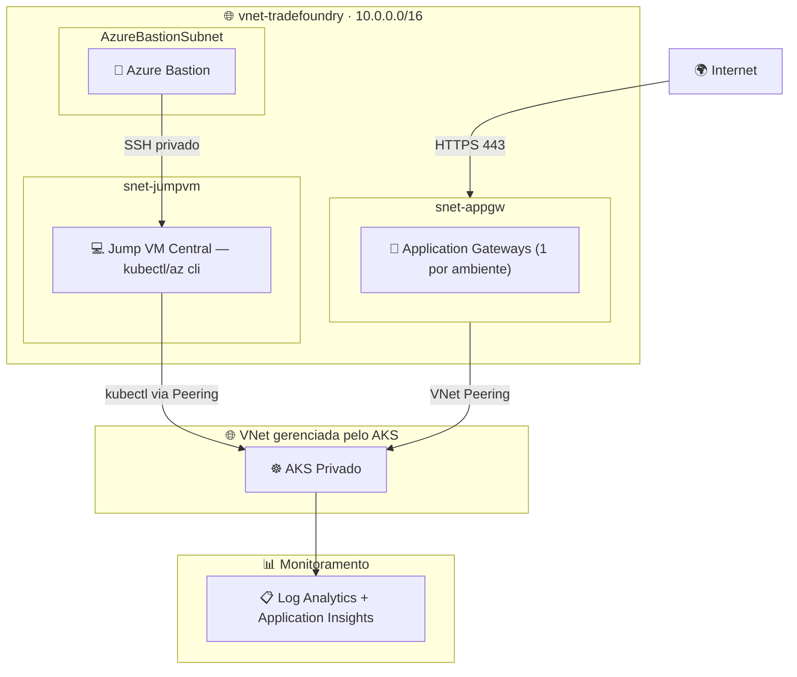
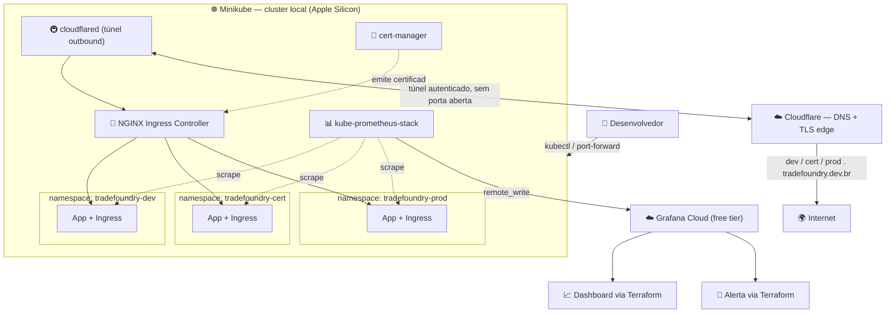

# 🏗️ TradeFoundry

### Infraestrutura como Código — De Azure a Local, sem perder a arquitetura

**Provisionamento de infraestrutura para uma fintech fictícia de mercado de capitais, em dois momentos: uma implementação real em Azure (Fase 1) e uma reconstrução 100% local de custo zero (Fase 2) — preservando os mesmos princípios de arquitetura.**

[](https://terraform.io)
[](https://kubernetes.io)
[](https://grafana.com)
[](https://github.com/iamtexwiller/TradeFoundry/actions)
[](#-fase-2--reconstru%C3%A7%C3%A3o-local-custo-zero)

[💡 Contexto](#-contexto) · [🏛️ Fase 1 — Azure](#%EF%B8%8F-fase-1--implementa%C3%A7%C3%A3o-original-em-azure-descontinuada) · [🏗️ Fase 2 — Local](#%EF%B8%8F-fase-2--reconstru%C3%A7%C3%A3o-local-custo-zero) · [🌍 Exposição real](#-exposi%C3%A7%C3%A3o-real-via-internet-tradefoundrydevbr) · [🚀 Como rodar](#-como-rodar) · [🔍 Decisões técnicas](#-decis%C3%B5es-t%C3%A9cnicas) · [🗺️ Roadmap](#%EF%B8%8F-roadmap)

---

## 💡 Contexto

**TradeFoundry** é uma fintech fictícia de mercado de capitais usada como estudo de caso para infraestrutura como código. O projeto provisiona três ambientes — **DEV**, **CERT** e **PROD** — espelhando o fluxo de promoção de ambientes comum em instituições financeiras (incluindo a B3, onde atuo profissionalmente como Application Support Engineer).

Este repositório documenta **duas fases** do mesmo projeto, de forma transparente:

| Fase | Onde rodou | Status |
|---|---|---|
| **Fase 1** | Microsoft Azure (AKS privado, Application Gateway, Bastion) | ✅ Implementada e validada — descontinuada por custo |
| **Fase 2** | Local (Minikube no Apple Silicon) + Grafana Cloud free tier | 🚀 Em construção — ambiente atual |

A Fase 1 não é um exercício teórico: a infraestrutura completa foi provisionada, testada e ficou em execução em Azure. Ela foi desativada exclusivamente por custo (créditos de estudante/trial esgotados), não por limitação técnica ou arquitetural. A Fase 2 nasce dessa decisão consciente: manter o valor de aprendizado e o portfólio público, sem custo recorrente.

---

## 🏛️ Fase 1 — Implementação original em Azure (descontinuada)

A primeira versão do TradeFoundry provisionou um ambiente Azure completo, com AKS privado, quatro sub-ambientes por namespace, Application Gateway dedicado por ambiente, e acesso controlado via Jump VM + Azure Bastion.



**Por que essa arquitetura existia:**
- **AKS privado** — sem endpoint público, reduzindo superfície de ataque (prática padrão em ambientes financeiros).
- **Jump VM + Azure Bastion** — único caminho de administração, sem expor SSH diretamente à internet.
- **VNet Peering + Private DNS Zone** — necessários porque o AKS privado cria sua própria VNet gerenciada, isolada da VNet principal.
- **Application Gateway por ambiente** — isolamento de tráfego de entrada entre dev/qaa/qab/cert.

Essa implementação está preservada (read-only) na branch [`fase-1-azure`](#) e seu código-fonte Terraform original permanece documentado para referência. **Foi desativada quando os créditos Azure se esgotaram** — não por falha de design.

> Se você está avaliando este projeto para uma vaga de Cloud/Platform Engineering: a Fase 1 demonstra a capacidade de operar isolamento de rede real (private endpoints, peering, bastion hosts). A Fase 2 demonstra a capacidade de tomar decisões de trade-off conscientes quando o orçamento é zero — uma habilidade igualmente real no dia a dia de operação.

---

## 🏗️ Fase 2 — Reconstrução local (custo zero)

A infraestrutura foi inteiramente remodelada para rodar localmente, **sem nenhum custo de nuvem**, preservando os princípios centrais: múltiplos ambientes isolados, ingress controlado, observabilidade centralizada e tudo gerenciado como código.



> Exposição via internet é **opcional** e controlada pela flag `expose_via_internet` (default `false`). O cluster funciona inteiramente offline; a exposição real via `tradefoundry.dev.br` é um módulo independente, descrito na seção [Exposição real via internet](#-exposição-real-via-internet-tradefoundrydevbr).

### Mapeamento de equivalências (Azure → Local)

| Componente original (Azure) | Equivalente local | Observação |
|---|---|---|
| AKS privado | Minikube | Cluster single-node, sem custo |
| 4 namespaces (dev/qaa/qab/cert) | **3 namespaces (dev/cert/prod)** | Simplificado para o fluxo de promoção mais universalmente reconhecido |
| Application Gateway (1 por ambiente) | NGINX Ingress Controller (1 controller, 1 Ingress por ambiente) | Helm chart oficial, sem custo |
| Jump VM + Azure Bastion | `kubectl` direto / port-forward | Sem fronteira de rede privada a proteger em ambiente local — ver [Decisões técnicas](#-decis%C3%B5es-t%C3%A9cnicas) |
| VNet Peering + Private DNS Zone | Rede interna do Docker/Minikube | Resolvido automaticamente pelo Minikube |
| Log Analytics + Application Insights | kube-prometheus-stack + Grafana Cloud (free tier) | Dashboard e alertas definidos via Terraform, não criados manualmente |
| Application Gateway + IP público + certificado gerenciado | Cloudflare Tunnel + cert-manager (DNS-01) | Domínio próprio `tradefoundry.dev.br`, TLS real, sem expor porta no roteador |
| Terraform + `azurerm` provider | Terraform + `kubernetes`, `helm`, `grafana`, `cloudflare` providers | IaC continua sendo a peça central do projeto |

### Stack tecnológico

[]()
[]()
[]()
[]()
[]()
[]()
[]()

---

## 🌍 Exposição real via internet (tradefoundry.dev.br)

Diferente da maioria dos projetos locais de portfólio, o TradeFoundry tem um domínio próprio já registrado — **tradefoundry.dev.br** — adquirido durante a Fase 1 em Azure e reaproveitado aqui. Isso permite ir além de `*.tradefoundry.local` e expor os três ambientes na internet de verdade, com TLS válido, sem custo recorrente e sem abrir portas no roteador residencial.

### Como funciona

- **Cloudflare Tunnel (`cloudflared`)** — roda como pod dentro do cluster e abre uma conexão *outbound* autenticada até a borda do Cloudflare. Não há porta de entrada exposta, não há IP residencial revelado, e funciona mesmo com IP dinâmico.
- **cert-manager + Let's Encrypt (desafio DNS-01)** — emite certificado TLS real para os subdomínios. DNS-01 foi escolhido em vez de HTTP-01 porque não depende da porta 80 estar acessível publicamente — o mesmo tipo de obstáculo já enfrentado e resolvido em outro projeto anterior, ao diagnosticar falhas de HTTP-01 por firewall em ambientes multi-namespace.
- **Cloudflare DNS (provider Terraform)** — os registros `dev.tradefoundry.dev.br`, `cert.tradefoundry.dev.br` e `prod.tradefoundry.dev.br` são criados como código, apontando para o túnel.

### Ativação opt-in

A exposição é **desligada por padrão** (`expose_via_internet = false`) — o projeto roda 100% local sem precisar de nenhuma credencial Cloudflare. Para ativar:

```hcl
# environments/local/terraform.tfvars
expose_via_internet = true

domain                             = "tradefoundry.dev.br"
letsencrypt_email                  = "seu-email@exemplo.com"
cloudflare_account_email           = "seu-email-cloudflare@exemplo.com"
cloudflare_api_token               = "<token com permissão Zone:DNS:Edit>"
cloudflare_zone_id                 = "<zone-id do domínio>"
cloudflare_tunnel_id               = "<gerado via cloudflared tunnel create>"
cloudflare_tunnel_credentials_json = "<conteúdo do credentials.json do túnel>"
```

```bash
terraform apply -var-file=environments/local/terraform.tfvars
```

Depois disso, os três ambientes ficam acessíveis publicamente:
- `https://dev.tradefoundry.dev.br`
- `https://cert.tradefoundry.dev.br`
- `https://prod.tradefoundry.dev.br`

---

## 📋 Estrutura do projeto

```
TradeFoundry/
├── main.tf                       # Orquestra todos os módulos
├── providers.tf                  # kubernetes + helm + grafana
├── backend.tf                    # backend local (state versionado)
├── variables.tf
├── modules/
│   ├── namespaces/                # dev, cert, prod + ResourceQuota
│   ├── ingress/                   # NGINX Ingress Controller (Helm) + Ingress por ambiente
│   ├── workload-demo/             # App de demonstração (nginx + /healthz) para gerar métricas reais
│   ├── observability/             # kube-prometheus-stack + dashboard/alerta via Grafana provider
│   └── exposure/                  # [opcional] Cloudflare Tunnel + cert-manager (DNS-01) — tradefoundry.dev.br
├── environments/
│   └── local/
│       └── terraform.tfvars.example
└── scripts/
    ├── setup.sh                   # Minikube + addons + terraform init/plan
    └── port-forward.sh            # Acesso aos ambientes (substitui o fluxo de Bastion)
```

---

## 🚀 Como rodar

### Pré-requisitos
- [Minikube](https://minikube.sigs.k8s.io/docs/start/)
- [kubectl](https://kubernetes.io/docs/tasks/tools/)
- [Helm](https://helm.sh/docs/intro/install/)
- [Terraform](https://developer.hashicorp.com/terraform/install) >= 1.8
- Conta gratuita no [Grafana Cloud](https://grafana.com/auth/sign-up/create-user) (free tier: 10k séries de métrica, 14 dias de retenção)

### Passos

```bash
# 1. Clone o repositório
git clone https://github.com/iamtexwiller/TradeFoundry.git
cd TradeFoundry

# 2. Configure suas credenciais do Grafana Cloud
cp environments/local/terraform.tfvars.example environments/local/terraform.tfvars
# edite o arquivo com os valores do seu painel Grafana Cloud

# 3. Rode o setup (inicia Minikube, habilita ingress, faz terraform init/plan)
./scripts/setup.sh

# 4. Revise o plano e aplique
terraform apply -var-file=environments/local/terraform.tfvars

# 5. Acesse um dos ambientes
./scripts/port-forward.sh dev
```

---

## 🔍 Decisões técnicas

### Por que remover o Jump VM e o Azure Bastion na versão local?

Esses componentes existem para proteger o acesso a um cluster que vive numa rede privada, dentro de uma organização com múltiplos usuários e superfícies de ataque reais. Em um ambiente local de desenvolvimento individual, essa fronteira de rede não existe — o cluster roda na própria máquina do desenvolvedor, atrás do próprio firewall doméstico/pessoal. Recriar Bastion e Jump VM via containers adicionaria complexidade sem ensinar nenhum conceito novo de segurança de rede; por isso a decisão foi documentar esse componente como parte da Fase 1 (onde ele fez sentido e funcionou) e não replicá-lo artificialmente na Fase 2.

### Por que 3 ambientes (dev/cert/prod) em vez dos 4 originais (dev/qaa/qab/cert)?

O fluxo DEV → CERT → PROD é o padrão mais amplamente reconhecido na indústria. Manter os 4 ambientes originais não traria custo adicional (namespaces são isolamento lógico, não consomem recursos extras só por existirem), mas a nomenclatura `qaa/qab` é específica de convenções internas — simplificar para 3 ambientes torna o projeto mais legível para qualquer pessoa de fora avaliando o portfólio.

### Por que Helm para o Ingress e Prometheus, mas Terraform para o restante?

O provider `helm` do Terraform permite gerenciar releases do Helm de forma totalmente declarativa — ou seja, o uso de Helm não quebra o princípio de "tudo como código", apenas delega a um chart maduro e testado pela comunidade (`ingress-nginx`, `kube-prometheus-stack`) em vez de reescrever manifests Kubernetes complexos do zero.

### Por que Grafana Cloud em vez de Grafana local?

Rodar Grafana localmente no cluster funcionaria, mas o objetivo aqui é simular um cenário mais próximo do real: observabilidade centralizada, acessível de qualquer lugar, sem depender do cluster estar no ar para consultar métricas históricas. O free tier do Grafana Cloud cobre perfeitamente esse caso de uso para um projeto de portfólio.

### Por que Cloudflare Tunnel em vez de expor uma porta direto no roteador?

Expor uma porta no roteador residencial exigiria IP fixo (ou DDNS), configuração de NAT/firewall, e exporia o IP real da rede doméstica — riscos desproporcionais para um projeto de portfólio. O Cloudflare Tunnel inverte a direção da conexão: o `cloudflared` dentro do cluster é quem inicia a conexão até a borda do Cloudflare, então nenhuma porta precisa ficar aberta e o IP residencial nunca é exposto.

### Limitações conhecidas

- O state do Terraform fica local (sem backend remoto) — aceitável para projeto individual, mas seria um ponto de melhoria para colaboração em equipe.
- A exposição via internet depende da disponibilidade da máquina local (Mac Mini) estar ligada e com o Minikube ativo — não é alta disponibilidade real, é adequado para demonstração de portfólio, não para produção.

---

## 🗺️ Roadmap

- [x] Fase 1 — Arquitetura Azure completa (AKS, Application Gateway, Bastion, monitoramento)
- [x] Documentação da Fase 1 preservada
- [x] Fase 2 — Definição da arquitetura local
- [x] **Módulo** — Namespaces (dev/cert/prod) + ResourceQuota
- [x] **Módulo** — Ingress (NGINX via Helm)
- [x] **Módulo** — Workload de demonstração (app + healthz)
- [x] **Módulo** — Observabilidade (kube-prometheus-stack + Grafana Cloud)
- [x] **Módulo** — Exposição via internet (Cloudflare Tunnel + cert-manager DNS-01, opt-in)
- [ ] Validação completa `terraform apply` em ambiente real
- [ ] Screenshots do dashboard Grafana Cloud em funcionamento
- [ ] Validação ponta a ponta de `https://dev.tradefoundry.dev.br` com certificado válido
- [ ] Testes automatizados de smoke test pós-deploy (GitHub Actions)

---

## 👤 Autor

**Tex Willer Gusman dos Santos**
Application Support Engineer L2 | Hybrid Cloud & On-Prem @ B3

[](https://www.linkedin.com/in/eutexwiller/)
[](https://www.texwiller.com.br)

---

**TradeFoundry — De Azure a Local, sem perder a arquitetura.**
Infraestrutura de mercado de capitais como código — agora também sem custo.
