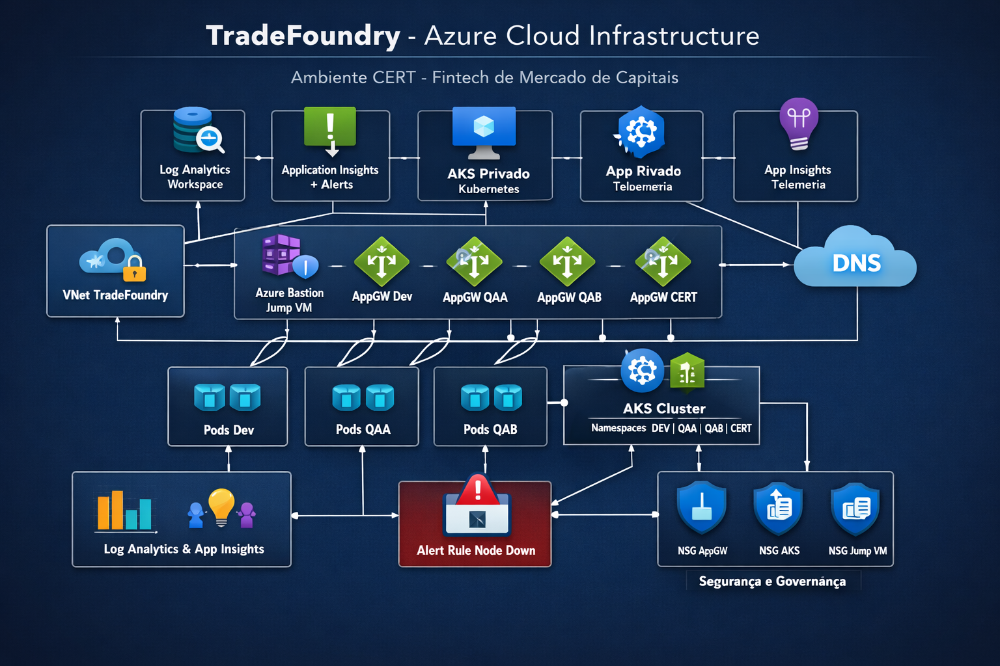
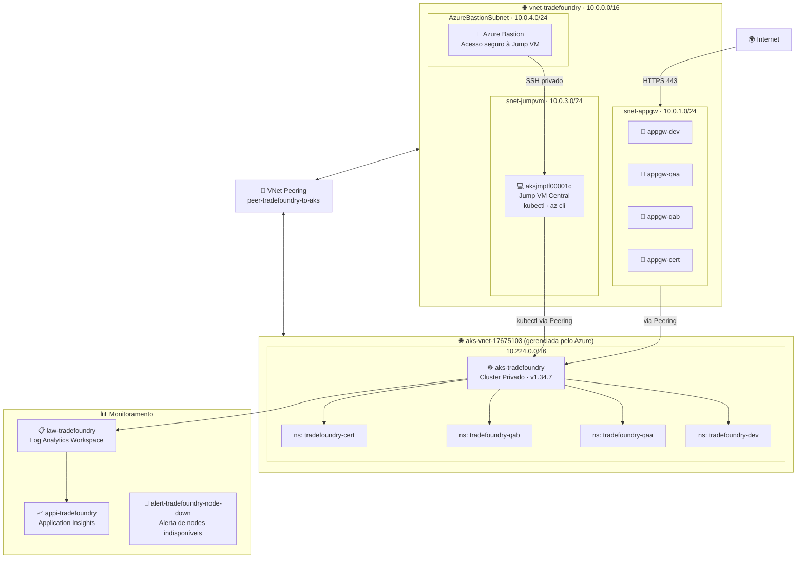

<div align="center">

# 🏗️ TradeFoundry

### Azure Cloud Infrastructure — Ambiente CERT

**Provisionamento completo de infraestrutura Azure para uma fintech de mercado de capitais,
espelhando a arquitetura real de ambientes de Pré-Produção com AKS privado, Jump VM centralizada, Application Gateways dedicados por ambiente e monitoramento centralizado.**

[](https://azure.microsoft.com)
[](https://learn.microsoft.com/certifications/azure-administrator/)
[](https://kubernetes.io)
[](https://terraform.io)
[](https://github.com/iamtexwiller/TradeFoundry/actions)
[](LICENSE)

[🏗️ Arquitetura](#️-arquitetura) · [📋 Recursos](#-recursos-provisionados) · [🔄 Fluxos](#-fluxo-de-acesso-ao-cluster) · [🗺️ Roadmap](#️-roadmap)

</div>

---

## 💡 Contexto

**TradeFoundry** é uma fintech fictícia de mercado de capitais que precisa de uma infraestrutura Azure completa, segura e escalável — modelada a partir de arquiteturas reais de ambientes de Pré-Produção financeiros.

O projeto provisiona um **único ambiente CERT** contendo quatro sub-ambientes separados por namespace no mesmo cluster AKS privado — exatamente como grandes instituições financeiras operam:

| Sub-ambiente | Namespace | Propósito |
|---|---|---|
| **DEV** | `tradefoundry-dev` | Desenvolvimento e integração contínua |
| **QAA** | `tradefoundry-qaa` | Quality Assurance — testes funcionais |
| **QAB** | `tradefoundry-qab` | Quality Assurance — testes de regressão |
| **CERT** | `tradefoundry-cert` | Certificação — homologação final com negócio e parceiros |

---

## 🏗️ Arquitetura





---

## 📋 Recursos provisionados

### 🔐 Governança
| Recurso | Nome | Descrição |
|---|---|---|
| Resource Group | `RG-TRADEFOUNDRY-CERT` | Container de todos os recursos |
| Azure Policy | `tradefoundry-require-tags` | Exige tags obrigatórias em todos os recursos |
| Tags obrigatórias | `environment · project · owner` | Rastreabilidade e governança |

### 🌐 Networking
| Recurso | Nome | CIDR / Detalhe |
|---|---|---|
| Virtual Network | `vnet-tradefoundry` | `10.0.0.0/16` |
| Subnet AppGW | `snet-appgw` | `10.0.1.0/24` |
| Subnet Jump VM | `snet-jumpvm` | `10.0.3.0/24` |
| Subnet Bastion | `AzureBastionSubnet` | `10.0.4.0/24` |
| NSG AppGW | `nsg-appgw` | Permite 80/443 + 65200-65535 (Internet) inbound |
| NSG AKS | `nsg-aks` | Permite apenas AppGW e Jump VM |
| NSG Jump VM | `nsg-jumpvm` | Permite apenas via Bastion |
| VNet Peering | `peer-tradefoundry-to-aks` | Conecta vnet-tradefoundry ↔ aks-vnet-17675103 |
| Private DNS Zone Link | `link-vnet-tradefoundry` | Resolução DNS privado do AKS |

> ⚠️ **Lição aprendida:** O NSG da subnet do Application Gateway V2 exige regra de entrada permitindo portas **65200-65535** com source **Internet** — necessário para o gerenciamento interno do serviço.

### 🔀 Application Gateways
| Recurso | Public IP | Namespace alvo |
|---|---|---|
| `appgw-dev` | `pip-appgw-dev` | `tradefoundry-dev` |
| `appgw-qaa` | `pip-appgw-qaa` | `tradefoundry-qaa` |
| `appgw-qab` | `pip-appgw-qab` | `tradefoundry-qab` |
| `appgw-cert` | `pip-appgw-cert` | `tradefoundry-cert` |

### ☸️ AKS — Cluster Privado
| Configuração | Valor |
|---|---|
| Nome | `aks-tradefoundry` |
| Versão | Kubernetes v1.34.7 |
| Tipo | **Privado** — sem endpoint público |
| VNet | `aks-vnet-17675103` (gerenciada pelo Azure) |
| Node | `aks-agentpool-42299989-vmss000000` · Ready |
| Namespaces | `tradefoundry-dev · tradefoundry-qaa · tradefoundry-qab · tradefoundry-cert` |
| Acesso | Exclusivamente via Jump VM `aksjmptf00001c` |

### 💻 Jump VM — Centralizada
| Configuração | Valor |
|---|---|
| Nome | `aksjmptf00001c` |
| OS | Ubuntu Server 24.04 LTS |
| IP | `10.0.3.4` (snet-jumpvm) |
| Acesso | Exclusivamente via Azure Bastion |
| Ferramentas | `kubectl · azure-cli` |

### 🔐 Azure Bastion
| Configuração | Valor |
|---|---|
| Nome | `bastion-tradefoundry` |
| Função | Acesso seguro à Jump VM sem expor SSH |
| Subnet | `AzureBastionSubnet` |

### 📊 Monitoramento
| Recurso | Nome | Descrição |
|---|---|---|
| Log Analytics Workspace | `law-tradefoundry` | Centraliza logs de todos os recursos |
| Application Insights | `appi-tradefoundry` | Monitoramento de aplicações (workspace-based) |
| Alert Rule | `alert-tradefoundry-node-down` | Alerta quando nodes do AKS ficam indisponíveis |

---

## 🔄 Fluxo de acesso ao cluster

```
Operador
    │
    │  Browser (HTTPS)
    ▼
Azure Bastion
    │
    │  SSH privado → 10.0.3.4
    ▼
Jump VM: aksjmptf00001c
    │
    │  kubectl (via VNet Peering)
    ▼
AKS Privado: aks-tradefoundry
    │
    ├── namespace: tradefoundry-dev
    ├── namespace: tradefoundry-qaa
    ├── namespace: tradefoundry-qab
    └── namespace: tradefoundry-cert
```

---

## 🔄 Fluxo de tráfego das aplicações

```
Internet / Parceiros externos
    │
    │  HTTPS 443
    ▼
Application Gateway (por ambiente)
    │
    │  Roteamento interno via VNet Peering
    ▼
AKS — Ingress Controller
    │
    ├── tradefoundry-dev  → Pods de desenvolvimento
    ├── tradefoundry-qaa  → Pods de QA funcional
    ├── tradefoundry-qab  → Pods de QA regressão
    └── tradefoundry-cert → Pods de homologação
```

---

## 🔍 Decisões técnicas

### Por que VNet Peering?
O AKS no modo privado cria uma VNet gerenciada pelo Azure (`aks-vnet-17675103`) separada da VNet principal. Para que a Jump VM consiga alcançar o endpoint privado do cluster (`10.224.0.4:443`), foi necessário criar um **VNet Peering bidirecional** entre as duas VNets.

### Por que Private DNS Zone Link?
O endpoint privado do AKS usa uma zona DNS privada (`privatelink.eastus2.azmk8s.io`). Para que a Jump VM resolva o FQDN do cluster, a zona DNS foi linkada à `vnet-tradefoundry` — sem isso, o `kubectl` não consegue resolver o hostname do cluster.

### Por que namespaces por ambiente?
Em vez de clusters separados (mais caro e complexo), os 4 ambientes compartilham o mesmo cluster AKS separados por namespace — exatamente como grandes instituições financeiras operam para otimizar recursos e manter isolamento lógico.

### Por que Application Gateway V2 exige regra Internet nas portas 65200-65535?
O Azure Application Gateway Standard V2 utiliza essas portas para comunicação interna de gerenciamento entre a infraestrutura do Azure e o gateway. Sem essa regra no NSG, o deployment falha com erro `ApplicationGatewaySubnetInboundTrafficBlockedByNetworkSecurityGroup`.

---

## 🗺️ Roadmap

- [x] Definição da arquitetura
- [x] Documentação
- [x] **Módulo 01** — Governança (RG + Policy + Tags)
- [x] **Módulo 02** — Networking (VNet + Subnets + NSGs + Bastion + Peering)
- [x] **Módulo 03** — Jump VM (`aksjmptf00001c` + kubectl + az cli)
- [x] **Módulo 04** — AKS privado + namespaces + Private DNS Zone
- [x] **Módulo 05** — Application Gateways (4 gateways — dev, qaa, qab, cert)
- [x] **Módulo 06** — Monitoramento (Log Analytics + App Insights + Alert)

---

## 🛠️ Stack tecnológico

<div align="center">


</div>

---

## 👤 Autor

**Tex Willer Gusman dos Santos**
Application Support Engineer L2 | Hybrid Cloud & On-Prem @ B3

[](https://www.linkedin.com/in/eutexwiller/)
[](https://www.texwiller.com.br)

---

<div align="center">

**TradeFoundry — Azure Cloud Infrastructure — Ambiente CERT**
Infraestrutura de mercado de capitais como código, espelhando arquiteturas reais de Pré-Produção.

</div>