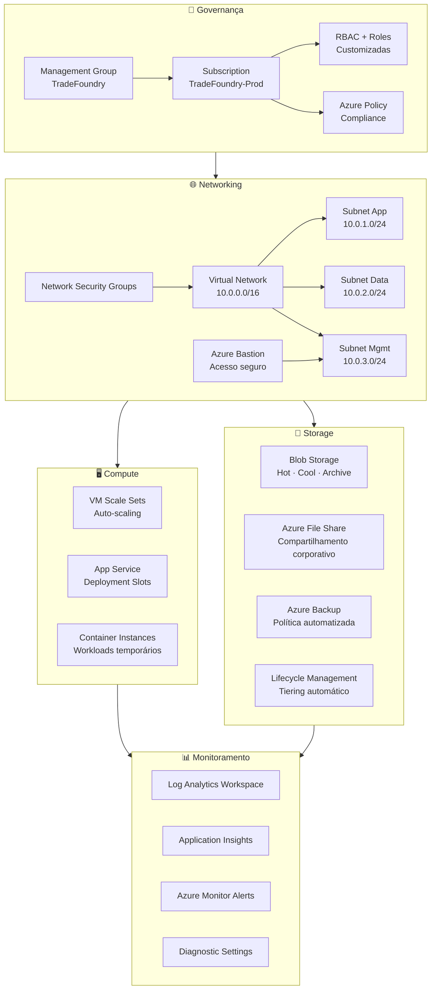

<div align="center">

# 🏗️ TradeFoundry

### Azure Cloud Infrastructure — From Zero to Production

**Provisionamento completo de infraestrutura Azure para uma fintech de mercado de capitais,
construído do zero como código — governança, redes, storage, compute e monitoramento.**

[](https://terraform.io)
[](https://azure.microsoft.com)
[](https://learn.microsoft.com/certifications/azure-administrator/)
[](https://github.com/iamtexwiller/TradeFoundry/actions)
[](LICENSE)

[🏗️ Arquitetura](#️-arquitetura) · [📁 Estrutura](#-estrutura) · [🚀 Deploy](#-deploy) · [📋 Módulos](#-módulos)

</div>

---

## 💡 Contexto

**TradeFoundry** é uma fintech fictícia de mercado de capitais que precisa de uma infraestrutura Azure completa, segura e escalável — provisionada inteiramente como código.

Este projeto documenta a construção dessa infraestrutura do zero, seguindo as melhores práticas do mercado:

- **Governança primeiro** — antes de qualquer recurso, definimos quem pode fazer o quê
- **Rede segmentada** — cada camada isolada com controles de acesso granulares
- **Tudo como código** — nenhum recurso criado manualmente no portal
- **Ambientes consistentes** — dev, staging e prod provisionados pelos mesmos módulos
- **Monitoramento nativo** — observabilidade desde o primeiro recurso

---

## 🏗️ Arquitetura



---

## 📁 Estrutura do projeto

```
TradeFoundry/
│
├── environments/                  → Configuração por ambiente
│   ├── dev/
│   │   ├── main.tf                → Entry point do ambiente dev
│   │   ├── variables.tf
│   │   ├── outputs.tf
│   │   └── terraform.tfvars       → Valores específicos do dev
│   ├── staging/
│   │   ├── main.tf
│   │   ├── variables.tf
│   │   ├── outputs.tf
│   │   └── terraform.tfvars
│   └── prod/
│       ├── main.tf
│       ├── variables.tf
│       ├── outputs.tf
│       └── terraform.tfvars
│
├── modules/                       → Módulos reutilizáveis
│   ├── 01-governance/             → Management Groups, RBAC, Policy
│   │   ├── main.tf
│   │   ├── variables.tf
│   │   ├── outputs.tf
│   │   └── README.md
│   ├── 02-networking/             → VNet, Subnets, NSG, Bastion
│   │   ├── main.tf
│   │   ├── variables.tf
│   │   ├── outputs.tf
│   │   └── README.md
│   ├── 03-storage/                → Blob, Files, Backup, Lifecycle
│   │   ├── main.tf
│   │   ├── variables.tf
│   │   ├── outputs.tf
│   │   └── README.md
│   ├── 04-compute/                → VMSS, App Service, ACI
│   │   ├── main.tf
│   │   ├── variables.tf
│   │   ├── outputs.tf
│   │   └── README.md
│   └── 05-monitoring/             → Log Analytics, Alerts, Insights
│       ├── main.tf
│       ├── variables.tf
│       ├── outputs.tf
│       └── README.md
│
├── .github/
│   └── workflows/
│       ├── terraform-plan.yml     → PR: roda terraform plan
│       └── terraform-apply.yml    → Merge: aplica infraestrutura
│
├── docs/
│   ├── architecture.md            → Documentação detalhada
│   ├── decisions.md               → Decisões de arquitetura (ADRs)
│   └── assets/
│       └── diagrams/
│
├── scripts/
│   ├── init.sh                    → Inicialização do projeto
│   └── destroy.sh                 → Destruição segura dos recursos
│
├── .terraform.lock.hcl
├── .gitignore
├── backend.tf                     → Remote state no Azure Storage
├── providers.tf                   → Provider Azure configurado
└── README.md
```

---

## 📋 Módulos

### 🔐 01 — Governança & Identidade
**O primeiro passo de qualquer infraestrutura corporativa.**

Antes de criar qualquer recurso, definimos quem pode fazer o quê e quais políticas se aplicam a toda a organização.

| Recurso | Descrição |
|---|---|
| Management Group | Hierarquia organizacional da TradeFoundry |
| Azure Policy | Bloqueia recursos fora de regiões permitidas |
| Azure Policy | Exige tags obrigatórias em todos os recursos |
| Azure Policy | Força criptografia em storage accounts |
| RBAC — Owner | Acesso total — apenas para o time de Cloud |
| RBAC — Contributor | Deploy de recursos — time de DevOps |
| RBAC — Reader | Leitura — time de suporte e auditoria |
| RBAC — Custom | Roles customizadas por squad |

### 🌐 02 — Networking
**A fundação da segurança — nada entra ou sai sem controle.**

| Recurso | CIDR | Descrição |
|---|---|---|
| Virtual Network | 10.0.0.0/16 | Rede principal da TradeFoundry |
| Subnet App | 10.0.1.0/24 | Aplicações e APIs |
| Subnet Data | 10.0.2.0/24 | Banco de dados e storage |
| Subnet Management | 10.0.3.0/24 | Bastion e ferramentas de gestão |
| NSG App | — | Permite 443 inbound, bloqueia o resto |
| NSG Data | — | Permite acesso apenas da subnet App |
| NSG Mgmt | — | Permite acesso apenas via Bastion |
| Azure Bastion | — | Acesso seguro às VMs sem RDP/SSH exposto |

### 💾 03 — Storage
**Dados financeiros exigem armazenamento inteligente e seguro.**

| Recurso | Configuração | Descrição |
|---|---|---|
| Blob Storage — Hot | LRS | Dados acessados frequentemente |
| Blob Storage — Cool | LRS | Dados acessados mensalmente |
| Blob Storage — Archive | LRS | Dados históricos e compliance |
| Lifecycle Policy | Automático | Hot → Cool após 30 dias |
| Lifecycle Policy | Automático | Cool → Archive após 90 dias |
| Azure File Share | SMB | Compartilhamento corporativo |
| Azure Backup | Diário | Retenção de 30 dias |
| SAS Tokens | Expiração 24h | Acesso temporário e auditável |

### 🖥️ 04 — Compute
**Escalabilidade automática para workloads de mercado financeiro.**

| Recurso | Configuração | Descrição |
|---|---|---|
| VM Scale Sets | Min: 2 / Max: 10 | Auto-scaling por CPU > 70% |
| App Service Plan | Standard S2 | Suporte a deployment slots |
| Deployment Slot — Staging | — | Testes antes de ir para produção |
| Deployment Slot — Production | — | Swap sem downtime |
| Container Instances | On-demand | Jobs temporários e batch |

### 📊 05 — Monitoramento
**Infraestrutura sem monitoramento é operar no escuro.**

| Recurso | Configuração | Descrição |
|---|---|---|
| Log Analytics Workspace | 30 dias retenção | Central de logs de todos os recursos |
| Diagnostic Settings | Todos os recursos | Envia logs para o workspace |
| Application Insights | — | Monitoramento de aplicações |
| Alert — CPU Alta | > 80% por 5min | Escala automática |
| Alert — Disponibilidade | < 99% | Notificação imediata |
| Alert — Storage | > 85% capacidade | Expansão proativa |
| Azure Monitor Workbook | — | Dashboard executivo |

---

## 🌍 Ambientes

| Ambiente | Propósito | Scale Sets | App Service | Retenção de Logs |
|---|---|---|---|---|
| **dev** | Desenvolvimento | Min: 1 / Max: 2 | Free F1 | 7 dias |
| **staging** | Homologação | Min: 1 / Max: 3 | Standard S1 | 14 dias |
| **prod** | Produção | Min: 2 / Max: 10 | Standard S2 | 30 dias |

---

## 🔄 Pipeline CI/CD

```
Pull Request aberto
        │
        ▼
GitHub Actions — terraform-plan.yml
        │
        ├── terraform fmt (valida formatação)
        ├── terraform init
        ├── terraform validate
        └── terraform plan → comentário automático no PR
        │
        ▼
Code Review + Aprovação
        │
        ▼
Merge na main
        │
        ▼
GitHub Actions — terraform-apply.yml
        │
        └── terraform apply → infraestrutura atualizada
```

---

## 🚀 Deploy

### Pré-requisitos
- Terraform >= 1.7
- Azure CLI autenticado (`az login`)
- Acesso à subscription TradeFoundry

### Inicialização

```bash
# Clone o repositório
git clone https://github.com/iamtexwiller/TradeFoundry.git
cd TradeFoundry

# Inicialize o ambiente desejado
cd environments/dev
terraform init
terraform plan
terraform apply
```

### Destruição segura

```bash
# Para evitar custos — destrua quando não estiver usando
cd environments/dev
terraform destroy
```

---

## 🗺️ Roadmap

- [x] Definição da arquitetura
- [x] Documentação inicial
- [ ] **Módulo 01** — Governança & Identidade
- [ ] **Módulo 02** — Networking
- [ ] **Módulo 03** — Storage
- [ ] **Módulo 04** — Compute
- [ ] **Módulo 05** — Monitoramento
- [ ] **Pipeline CI/CD** — Terraform plan/apply automatizado
- [ ] **Ambiente Dev** — primeiro ambiente completo
- [ ] **Ambiente Staging** — validação
- [ ] **Ambiente Prod** — produção completa

---

## 🛠️ Stack tecnológico

<div align="center">


</div>

---

## 👤 Autor

**Tex Willer Gusman dos Santos**
Application Support Engineer L2 | Hybrid Cloud & On-Prem @ B3

[](https://www.linkedin.com/in/eutexwiller/)
[](https://www.texwiller.com.br)

---

<div align="center">

**TradeFoundry — Azure Cloud Infrastructure From Zero to Production**
Construindo infraestrutura de mercado de capitais como código, do zero à produção.

</div>
