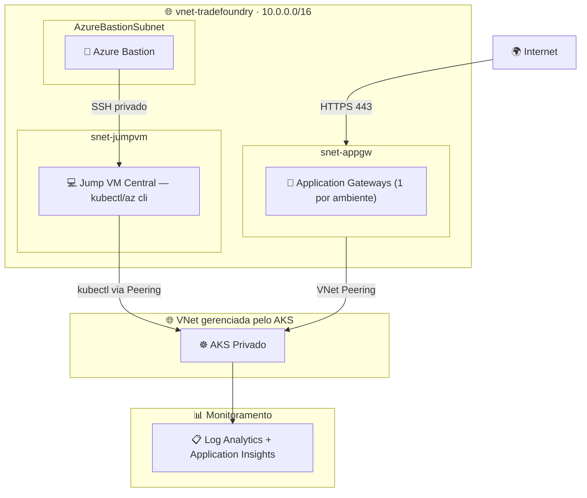
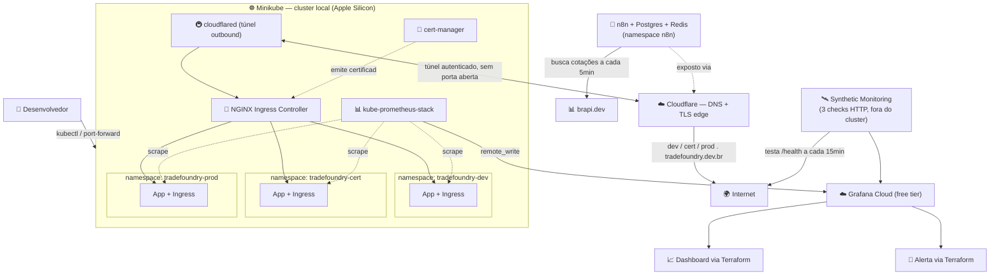
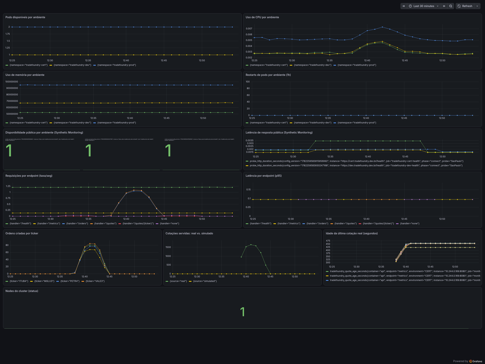
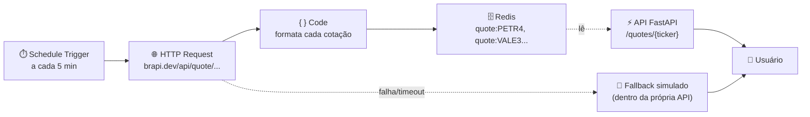
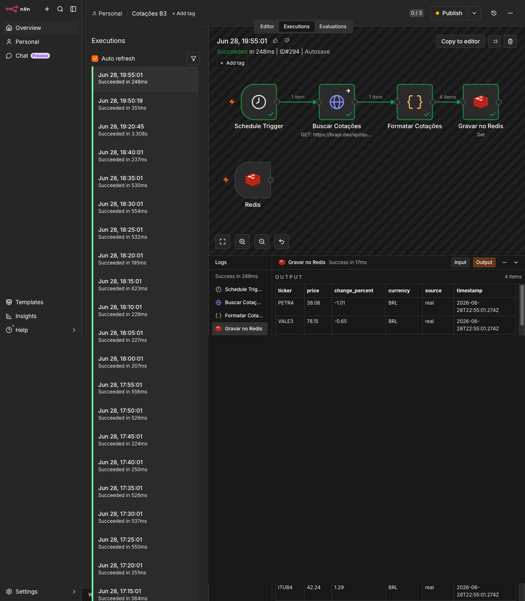

# 🏗️ TradeFoundry

### Infraestrutura como Código — De Azure a Local, sem perder a arquitetura

**Provisionamento de infraestrutura para uma fintech fictícia de mercado de capitais, em dois momentos: uma implementação real em Azure (Fase 1) e uma reconstrução 100% local de custo zero (Fase 2) — preservando os mesmos princípios de arquitetura.**

[](https://terraform.io)
[](https://kubernetes.io)
[](https://grafana.com)
[](https://github.com/iamtexwiller/TradeFoundry/actions)
[](#-fase-2--reconstru%C3%A7%C3%A3o-local-custo-zero)

[💡 Contexto](#-contexto) · [🏛️ Fase 1 — Azure](#%EF%B8%8F-fase-1--implementa%C3%A7%C3%A3o-original-em-azure-descontinuada) · [🏗️ Fase 2 — Local](#%EF%B8%8F-fase-2--reconstru%C3%A7%C3%A3o-local-custo-zero) · [🌍 Exposição real](#-exposi%C3%A7%C3%A3o-real-via-internet-tradefoundrydevbr) · [🚀 Como rodar](#-como-rodar) · [🐛 Dificuldades](#-dificuldades-encontradas-e-como-foram-resolvidas) · [🔍 Decisões técnicas](#-decis%C3%B5es-t%C3%A9cnicas) · [🗺️ Roadmap](#%EF%B8%8F-roadmap)

---

## 💡 Contexto

**TradeFoundry** é uma fintech fictícia de mercado de capitais usada como estudo de caso para infraestrutura como código. O projeto provisiona três ambientes — **DEV**, **CERT** e **PROD** — espelhando o fluxo de promoção de ambientes comum em instituições financeiras (incluindo a B3, onde atuo profissionalmente como Application Support Engineer).

Este repositório documenta **duas fases** do mesmo projeto, de forma transparente:

| Fase | Onde rodou | Status |
|---|---|---|
| **Fase 1** | Microsoft Azure (AKS privado, Application Gateway, Bastion) | ✅ Implementada e validada — descontinuada por custo |
| **Fase 2** | Local (Minikube no Apple Silicon) + Grafana Cloud free tier | 🚀 Em construção — ambiente atual |

A Fase 1 não é um exercício teórico: a infraestrutura completa foi provisionada, testada e ficou em execução em Azure. Ela foi desativada exclusivamente por custo (créditos de estudante/trial esgotados), não por limitação técnica ou arquitetural. A Fase 2 nasce dessa decisão consciente: manter o valor de aprendizado e o portfólio público, sem custo recorrente.

---

## 🏛️ Fase 1 — Implementação original em Azure (descontinuada)

A primeira versão do TradeFoundry provisionou um ambiente Azure completo, com AKS privado, quatro sub-ambientes por namespace, Application Gateway dedicado por ambiente, e acesso controlado via Jump VM + Azure Bastion.



**Por que essa arquitetura existia:**
- **AKS privado** — sem endpoint público, reduzindo superfície de ataque (prática padrão em ambientes financeiros).
- **Jump VM + Azure Bastion** — único caminho de administração, sem expor SSH diretamente à internet.
- **VNet Peering + Private DNS Zone** — necessários porque o AKS privado cria sua própria VNet gerenciada, isolada da VNet principal.
- **Application Gateway por ambiente** — isolamento de tráfego de entrada entre dev/qaa/qab/cert.

Essa implementação está preservada (read-only) na branch [`fase-1-azure`](#) e seu código-fonte Terraform original permanece documentado para referência. **Foi desativada quando os créditos Azure se esgotaram** — não por falha de design.

> A Fase 1 demonstra a capacidade de operar isolamento de rede real (private endpoints, peering, bastion hosts). A Fase 2 demonstra a capacidade de tomar decisões de trade-off conscientes quando o orçamento é zero — uma habilidade igualmente real no dia a dia de operação.

---

## 🏗️ Fase 2 — Reconstrução local (custo zero)

A infraestrutura foi inteiramente remodelada para rodar localmente, **sem nenhum custo de nuvem**, preservando os princípios centrais: múltiplos ambientes isolados, ingress controlado, observabilidade centralizada e tudo gerenciado como código.



> Exposição via internet é **opcional** e controlada pela flag `expose_via_internet` (default `false`). O cluster funciona inteiramente offline; a exposição real via `tradefoundry.dev.br` é um módulo independente, descrito na seção [Exposição real via internet](#-exposição-real-via-internet-tradefoundrydevbr). O n8n (`enable_n8n`) é igualmente opcional — ver seção [Cotações reais via n8n](#cotações-reais-via-n8n--automação-de-dados-com-fallback-gracioso).

### Mapeamento de equivalências (Azure → Local)

| Componente original (Azure) | Equivalente local | Observação |
|---|---|---|
| AKS privado | Minikube | Cluster single-node, sem custo |
| 4 namespaces (dev/qaa/qab/cert) | **3 namespaces (dev/cert/prod)** | Simplificado para o fluxo de promoção mais universalmente reconhecido |
| Application Gateway (1 por ambiente) | NGINX Ingress Controller (1 controller, 1 Ingress por ambiente) | Helm chart oficial, sem custo |
| Jump VM + Azure Bastion | `kubectl` direto / port-forward | Sem fronteira de rede privada a proteger em ambiente local — ver [Decisões técnicas](#-decis%C3%B5es-t%C3%A9cnicas) |
| VNet Peering + Private DNS Zone | Rede interna do Docker/Minikube | Resolvido automaticamente pelo Minikube |
| Log Analytics + Application Insights | kube-prometheus-stack + Grafana Cloud (free tier) | Dashboard e alertas definidos via Terraform, não criados manualmente |
| Application Gateway + IP público + certificado gerenciado | Cloudflare Tunnel + cert-manager (DNS-01) | Domínio próprio `tradefoundry.dev.br`, TLS real, sem expor porta no roteador |
| Terraform + `azurerm` provider | Terraform + `kubernetes`, `helm`, `grafana`, `cloudflare` providers | IaC continua sendo a peça central do projeto |
| — (não existia na Fase 1) | Grafana Cloud Synthetic Monitoring | Testa os 3 ambientes de fora do cluster (como um usuário real), a cada 15min, sem custo |
| — (não existia na Fase 1) | n8n + PostgreSQL + Redis | Automação de uso geral; primeiro caso de uso: cotações reais da B3 com fallback gracioso |

### Observabilidade — visão interna + visão externa

O dashboard "TradeFoundry — Visão Geral dos Ambientes" combina duas perspectivas complementares:

- **Visão interna** (via `kube-prometheus-stack`) — pods disponíveis, uso de CPU, memória e restarts por ambiente, coletados de dentro do cluster.
- **Visão externa** (via Grafana Cloud Synthetic Monitoring) — disponibilidade e latência medidas de fora do cluster, simulando o acesso real de um usuário via `https://{dev,cert,prod}.tradefoundry.dev.br/health`, a cada 15 minutos.

Essa combinação detecta categorias de problema diferentes: a visão interna mostra "o pod está saudável?", enquanto a visão externa mostra "o caminho completo até o usuário está saudável?" — incluindo Ingress, Cloudflare Tunnel e DNS. Foi exatamente esse tipo de problema (roteamento de `Host` no Ingress, documentado no item 12 das dificuldades) que a visão externa teria detectado automaticamente, sem precisar de verificação manual.



*Dashboard real em produção (deste projeto) — métricas internas (Prometheus local) e externas (Synthetic Monitoring) lado a lado, todas definidas como código via Terraform.*

### Cotações reais via n8n — automação de dados com fallback gracioso

A API do TradeFoundry (`/quotes`, `/quotes/{ticker}`) expõe cotações de 4 ações da B3 com acesso gratuito e irrestrito na [brapi.dev](https://brapi.dev) (PETR4, VALE3, ITUB4, MGLU3). Em vez da própria API consultar essa fonte externa a cada request, essa responsabilidade foi deliberadamente extraída para o **n8n** — uma plataforma de automação de uso geral, adicionada ao projeto também como ferramenta de aprendizado contínuo, não só como peça de infraestrutura para este caso específico.



**Por que separar a busca de dados (n8n) da exposição de dados (API)?**

- **Resiliência por camadas** — se a brapi.dev cair, o n8n simplesmente não atualiza o Redis naquele ciclo; a API continua servindo o último valor cacheado, e só recorre ao fallback simulado se não houver *nenhum* dado no Redis (ex: na primeira inicialização, antes do workflow rodar). Duas camadas de tolerância a falha, não uma.
- **API permanece simples e rápida** — ela nunca depende de uma chamada de rede externa no caminho crítico de uma requisição do usuário; só lê do Redis, que está na mesma rede interna do cluster.
- **n8n como ferramenta de uso geral** — a interface (`https://n8n.tradefoundry.dev.br`, protegida por autenticação básica) está disponível para criar outros workflows no futuro, não fica limitada a esse caso de uso específico.

**Componentes de infraestrutura do n8n:**

| Componente | Função |
|---|---|
| PostgreSQL | Armazena workflows, credenciais e histórico de execuções (SQLite, o default, não é recomendado pelo próprio n8n para uso real) |
| Redis | Cache das cotações, compartilhado entre o n8n (escreve) e a API (lê) |
| n8n | Interface de automação, exposta publicamente com autenticação básica |



*Workflow rodando de forma autônoma, a cada 5 minutos, sem intervenção manual — histórico real de execuções (deste projeto) com o output do node Redis confirmando os 4 tickers gravados com `source: "real"`.*

### Stack tecnológico

[]()
[]()
[]()
[]()
[]()
[]()
[]()

---

## 🌍 Exposição real via internet (tradefoundry.dev.br)

Diferente da maioria dos projetos locais de portfólio, o TradeFoundry tem um domínio próprio já registrado — **tradefoundry.dev.br** — adquirido durante a Fase 1 em Azure e reaproveitado aqui. Isso permite ir além de `*.tradefoundry.local` e expor os três ambientes na internet de verdade, com TLS válido, sem custo recorrente e sem abrir portas no roteador residencial.

### Como funciona

- **Cloudflare Tunnel (`cloudflared`)** — roda como pod dentro do cluster e abre uma conexão *outbound* autenticada até a borda do Cloudflare. Não há porta de entrada exposta, não há IP residencial revelado, e funciona mesmo com IP dinâmico.
- **cert-manager + Let's Encrypt (desafio DNS-01)** — emite certificado TLS real para os subdomínios. DNS-01 foi escolhido em vez de HTTP-01 porque não depende da porta 80 estar acessível publicamente — o mesmo tipo de obstáculo já enfrentado e resolvido em outro projeto anterior, ao diagnosticar falhas de HTTP-01 por firewall em ambientes multi-namespace.
- **Cloudflare DNS (provider Terraform)** — os registros `dev.tradefoundry.dev.br`, `cert.tradefoundry.dev.br` e `prod.tradefoundry.dev.br` são criados como código, apontando para o túnel.

### Ativação opt-in

A exposição é **desligada por padrão** (`expose_via_internet = false`) — o projeto roda 100% local sem precisar de nenhuma credencial Cloudflare. Para ativar:

```hcl
# environments/local/terraform.tfvars
expose_via_internet = true

domain                             = "tradefoundry.dev.br"
letsencrypt_email                  = "seu-email@exemplo.com"
cloudflare_account_email           = "seu-email-cloudflare@exemplo.com"
cloudflare_api_token               = "<token com permissão Zone:DNS:Edit>"
cloudflare_zone_id                 = "<zone-id do domínio>"
cloudflare_tunnel_id               = "<gerado via cloudflared tunnel create>"
cloudflare_tunnel_credentials_json = "<conteúdo do credentials.json do túnel>"
```

```bash
terraform apply -var-file=environments/local/terraform.tfvars
```

Para ativar também o Synthetic Monitoring (requer `expose_via_internet = true`, já que os checks testam o domínio público):

```hcl
enable_synthetic_monitoring = true
grafana_sm_access_token     = "<token gerado em Testing & synthetics > Synthetics > Config > Access tokens>"
grafana_sm_url              = "https://synthetic-monitoring-api-sa-east-1.grafana.net"
```

Depois disso, os três ambientes ficam acessíveis publicamente:
- `https://dev.tradefoundry.dev.br`
- `https://cert.tradefoundry.dev.br`
- `https://prod.tradefoundry.dev.br`

> ✅ **Validado em produção (deste projeto):** os três hosts acima respondem `HTTP/2 200` com certificado TLS válido, servidos via Cloudflare (datacenter GRU — São Paulo), com o túnel `cloudflared` mantendo 4 conexões QUIC simultâneas e 100% de saúde no pre-check de conectividade.

---

## 📋 Estrutura do projeto

```
TradeFoundry/
├── main.tf                       # Orquestra todos os módulos
├── providers.tf                  # kubernetes + helm + grafana
├── backend.tf                    # backend local (state versionado)
├── variables.tf
├── modules/
│   ├── namespaces/                # dev, cert, prod + ResourceQuota
│   ├── ingress/                   # NGINX Ingress Controller (Helm) + Ingress por ambiente
│   ├── workload-demo/             # API FastAPI (cotações + ordens simuladas, fallback gracioso) — código em app/
│   ├── observability/             # kube-prometheus-stack + dashboard/alerta via Grafana provider
│   ├── exposure/                  # [opcional] Cloudflare Tunnel + cert-manager (DNS-01) — tradefoundry.dev.br
│   ├── n8n/                       # [opcional] n8n + PostgreSQL + Redis — automação geral, exposto em n8n.tradefoundry.dev.br
│   └── synthetic-monitoring/      # [opcional] Grafana Cloud Synthetic Monitoring — 3 checks HTTP externos
├── environments/
│   └── local/
│       └── terraform.tfvars.example
└── scripts/
    ├── setup.sh                   # Minikube + addons + terraform init/plan
    └── port-forward.sh            # Acesso aos ambientes (substitui o fluxo de Bastion)
```

---

## 🚀 Como rodar

### Pré-requisitos
- [Minikube](https://minikube.sigs.k8s.io/docs/start/)
- [kubectl](https://kubernetes.io/docs/tasks/tools/)
- [Helm](https://helm.sh/docs/intro/install/)
- [Terraform](https://developer.hashicorp.com/terraform/install) >= 1.8
- Conta gratuita no [Grafana Cloud](https://grafana.com/auth/sign-up/create-user) (free tier: 10k séries de métrica, 14 dias de retenção)

### Passos

```bash
# 1. Clone o repositório
git clone https://github.com/iamtexwiller/TradeFoundry.git
cd TradeFoundry

# 2. Configure suas credenciais do Grafana Cloud
cp environments/local/terraform.tfvars.example environments/local/terraform.tfvars
# edite o arquivo com os valores do seu painel Grafana Cloud

# 3. Rode o setup (inicia Minikube, habilita ingress, faz terraform init/plan)
./scripts/setup.sh

# 4. Revise o plano e aplique
terraform apply -var-file=environments/local/terraform.tfvars

# 5. Acesse um dos ambientes
./scripts/port-forward.sh dev
```

---

## 🐛 Dificuldades encontradas (e como foram resolvidas)

Nenhum `terraform apply` sai perfeito na primeira tentativa — e documentar os problemas reais encontrados é, na prática, mais valioso para portfólio do que fingir que tudo funcionou de primeira. Esta seção registra os obstáculos enfrentados durante a construção e validação deste projeto.

### 1. Provider resolvido com namespace errado (`hashicorp/grafana` em vez de `grafana/grafana`)

`terraform init` falhava ao tentar resolver `hashicorp/grafana` e `hashicorp/cloudflare` — providers que não existem nesse namespace. A causa: módulos filhos que usam um provider de terceiros precisam declarar seu **próprio** bloco `required_providers` com `source`, mesmo que o módulo raiz já declare o mesmo provider corretamente. Sem isso, o Terraform assume o namespace padrão `hashicorp/*` *para aquele módulo especificamente*. Corrigido adicionando um `providers.tf` em cada módulo (`namespaces`, `ingress`, `workload-demo`, `observability`, `exposure`) com `required_version` e `version` explícitos.

### 2. Validação de token do provider Cloudflare disparada mesmo com o módulo desligado

Com `expose_via_internet = false` e o módulo `exposure` usando `count = 0`, o provider Cloudflare ainda assim exigia um `api_token` válido — o Terraform inicializa **todos os providers declarados no `providers.tf` raiz**, independentemente de `count` em módulos. A mensagem de erro ("API tokens must only contain characters a-z, A-Z, 0-9, hyphens and underscores") também era enganosa: o problema real, [documentado em uma issue pública do provider desde 2022](https://github.com/cloudflare/terraform-provider-cloudflare/issues/1966) e ainda presente, é que o provider exige um token de **exatamente 40 caracteres** — qualquer valor com tamanho diferente dispara essa mesma mensagem sobre caracteres, mesmo quando os caracteres em si são válidos. Corrigido com um placeholder padrão de 40 caracteres alfanuméricos como `default` da variável.

### 3. Dependência circular entre o Helm release e o Secret de credenciais

O `helm_release.kube_prometheus_stack` usava `create_namespace = true` para criar o namespace `monitoring`, mas seu próprio `values.yaml` referenciava um `kubernetes_secret` que precisava existir *dentro* desse namespace. O Terraform tentava criar o Secret antes do namespace existir, gerando `namespaces "monitoring" not found`. Corrigido criando o namespace como um recurso `kubernetes_namespace` explícito e independente, com o Secret e o Helm release referenciando-o via `depends_on`, eliminando a circularidade.

### 4. Conflito entre o addon nativo do Minikube e o Ingress gerenciado via Helm

O `minikube addons enable ingress` instala seu próprio NGINX Ingress Controller, fora do controle do Terraform. Quando o `helm_release.nginx_ingress` tentou instalar o mesmo controller via Helm, encontrou um `ServiceAccount` já existente sem a ownership esperada pelo Helm (`invalid ownership metadata`). Corrigido desabilitando o addon nativo (`minikube addons disable ingress`) e deixando o Terraform ser a única fonte de verdade para o Ingress Controller.

### 5. Dois tokens do Grafana Cloud com escopos diferentes, mesma variável

O token gerado na tela "Hosted Prometheus metrics" (prefixo `glc_...`) tem permissão apenas de **escrita de métricas** — suficiente para o `remote_write` do Prometheus, mas insuficiente para o provider Terraform do Grafana, que fala com a API HTTP de administração para criar `grafana_dashboard`, `grafana_folder` e `grafana_rule_group`. Usar esse token para ambos os propósitos resultava em `401 Invalid API key` ao criar dashboards e folders. Corrigido separando em duas variáveis: `grafana_cloud_prometheus_password` (o token `glc_...`, usado só no Secret do remote_write) e `grafana_cloud_api_key` (um token de **Service Account** com role Admin, prefixo `glsa_...`, usado pelo provider Grafana).

### 6. `minikube tunnel` resetando conexões com múltiplos Ingress simultâneos

Com três `Ingress` resources ativos ao mesmo tempo (dev/cert/prod), o `minikube tunnel` (driver `docker`, macOS) aceitava a conexão TCP na porta 80 mas resetava a requisição HTTP no meio (`Recv failure: Connection reset by peer`) — um comportamento conhecido do driver `docker` nesse cenário. Isolado o problema testando o Ingress Controller diretamente via `kubectl port-forward`, que funcionou de imediato nos três ambientes. `port-forward` passou a ser o método de acesso local padrão do projeto (ver `scripts/port-forward.sh`), com o `minikube tunnel` descartado.

### 7. `tflint` quebrando o CI por warnings, não erros

O workflow `terraform-validate.yml` falhava com `exit code 2` mesmo sem nenhum erro real de configuração — o `tflint` retorna código de saída não-zero ao encontrar **warnings**, e o workflow não tinha tolerância configurada para isso. As 15 ocorrências eram todas do mesmo padrão: módulos sem `required_version` e sem `version` constraint nos seus `required_providers`. Resolvido adicionando esses dois itens em todos os `providers.tf` dos módulos (ver item 1).

### 8. `kubernetes_manifest` validando CRDs que ainda não existem no `plan`

Ao provisionar o `ClusterIssuer` e o `Certificate` do cert-manager via `kubernetes_manifest`, o `terraform plan` falhava com `API did not recognize GroupVersionKind from manifest (CRD may not be installed)`. A causa: esse recurso faz uma chamada real à API do Kubernetes para validar o schema do manifesto **já durante o `plan`**, mas o CRD do cert-manager só existe no cluster depois que o `helm_release.cert_manager` roda de fato no `apply` — uma dependência que o Terraform não consegue resolver sozinho nesse tipo de recurso. Corrigido substituindo por `kubectl_manifest` (provider `gavinbunney/kubectl`), que aplica o YAML sem essa validação prematura de schema.

### 9. Chart Helm oficial da Cloudflare incompatível com o fluxo de autenticação via CLI

A primeira tentativa de instalar o `cloudflared` usou o chart oficial `cloudflare/cloudflare-tunnel-remote`, mas esse chart espera um **`TUNNEL_TOKEN`** — um token gerado pelo dashboard Zero Trust da Cloudflare — enquanto o fluxo usado neste projeto (`cloudflared tunnel login` + `cloudflared tunnel create`, via CLI) gera um `credentials.json`, formato incompatível com esse chart. Além disso, a versão de chart inicialmente especificada (`0.2.0`) nem existia no repositório. Corrigido trocando para o chart da comunidade `community-charts/cloudflared`, desenhado especificamente para aceitar credenciais geradas via CLI.

### 10. Estrutura de secrets do chart `community-charts/cloudflared` exigindo três tentativas

Mesmo com o chart correto, a estrutura de `values` passou por três iterações até funcionar:
1. Passar o nome do Secret como string simples (`existingConfigJsonFileSecret = "nome-do-secret"`) falhou — o template espera um objeto `{ name = "..." }`, não uma string.
2. Corrigida a estrutura para `{ name = ... }`, mas faltava um segundo Secret obrigatório: o certificado de origem (`cert.pem`, gerado por `cloudflared tunnel login` — arquivo diferente do `credentials.json`, gerado por `cloudflared tunnel create`). O chart rejeitava a instalação pedindo esse arquivo em base64.
3. Mesmo referenciando os dois Secrets via `existingConfigJsonFileSecret`/`existingPemFileSecret`, o template continuava falhando com a mesma mensagem de "base64 required" — sinal de que essa via não estava sendo reconhecida corretamente nesta versão do chart. Resolvido definitivamente usando a forma alternativa documentada pelo próprio chart, `base64EncodedConfigJsonFile`/`base64EncodedPemFile`, com a codificação feita pela função nativa `base64encode()` do Terraform a partir das variáveis já existentes — eliminando a necessidade de gerenciar Secrets do Kubernetes separados para esse propósito.

Após essa correção, o túnel conectou de imediato (4 conexões QUIC registradas, pre-check de conectividade 100% saudável), e os três ambientes (`dev`, `cert`, `prod`) responderam `HTTP/2 200` via `https://*.tradefoundry.dev.br`, com certificado TLS válido.

### 11. `kube-prometheus-stack` ultrapassando o limite de active series do Grafana Cloud Free tier

Algumas semanas após o deploy inicial, a Grafana notificou por e-mail que a conta havia atingido **10,6 mil de 10 mil séries ativas** incluídas no Free tier — o limite havia sido excedido. O painel de **Billing/Usage** confirmou que 100% do consumo era de métricas (todas as outras categorias — logs, traces, synthetics — estavam zeradas), isolando a causa ao Prometheus.

**Causa raiz:** o `kube-prometheus-stack` coleta, por padrão, métricas detalhadas de **todos** os componentes do cluster — etcd, scheduler, kubelet completo, cAdvisor (métricas de container granulares), e o `kube-state-metrics` inteiro — independentemente de quais métricas o projeto de fato consome. O dashboard e o alerta deste projeto usam só três métricas (`kube_pod_status_ready`, `container_cpu_usage_seconds_total`, `kube_node_status_condition`), mas o `remote_write` estava enviando *todas* as séries coletadas pelo stack, não apenas essas três.

**Correção** — filtro por allowlist via `writeRelabelConfigs`, aplicado na configuração do `remote_write` do Prometheus, descartando qualquer métrica fora da lista permitida antes de saber do cluster:

```hcl
remoteWrite = [
  {
    url = var.grafana_cloud_prometheus_remote_write_url
    basicAuth = { ... }
    writeRelabelConfigs = [
      {
        sourceLabels = ["__name__"]
        regex        = "kube_pod_status_ready|container_cpu_usage_seconds_total|kube_node_status_condition"
        action       = "keep"
      }
    ]
  }
]
```

Essa abordagem resolve o problema na origem — as métricas não usadas nunca saem do cluster e, portanto, nunca contam contra o limite de active series do plano gratuito, independente de quanto o `kube-prometheus-stack` colete internamente.

### 12. Ingress não reconhecendo o `Host` público enviado pelo Cloudflare Tunnel

Ao trocar a rota de health check de uma página HTML (`/healthz`) para uma resposta JSON mais simples (`/health`), os três ambientes voltaram a retornar 404 — mas só via `tradefoundry.dev.br`; localmente (`*.tradefoundry.local`), tudo funcionava.

**Diagnóstico, camada por camada:**
1. Pod: `wget` de dentro do próprio container retornou `200` com o JSON correto — pod saudável.
2. Service/Endpoint: `port-forward` direto no Service também retornou `200` — Service saudável.
3. Ingress Controller via `port-forward`, usando `Host: dev.tradefoundry.local`: `200` — Ingress saudável para o host local.
4. O mesmo teste, mas com `Host: dev.tradefoundry.dev.br` (o host real que o domínio público usa): **404**.

**Causa raiz:** o recurso `Ingress` só tinha uma única `rule`, com `host = "${ambiente}.tradefoundry.local"`. O `cloudflared` encaminha a requisição com o `Host` header do domínio público (`dev.tradefoundry.dev.br`), que o Ingress nunca foi configurado para reconhecer — resultando no 404 padrão do nginx, apesar de toda a cadeia interna (pod, Service) estar saudável.

**Correção** — adicionada uma segunda `rule` dinâmica no Ingress, condicionada à variável `public_domain` (vazia quando `expose_via_internet = false`, preenchida com o domínio real quando ativado):

```hcl
dynamic "rule" {
  for_each = var.public_domain != "" ? [var.public_domain] : []

  content {
    host = "${each.key}.${rule.value}"
    http {
      path {
        path      = "/"
        path_type = "Prefix"
        backend {
          service {
            name = "tradefoundry-app-${each.key}"
            port { number = 80 }
          }
        }
      }
    }
  }
}
```

Esse caso reforça um padrão de debugging útil: quando algo funciona localmente mas falha via domínio público, isolar cada camada da cadeia (pod → Service → Ingress) com o `Host` header exato usado em cada contexto revela exatamente onde a divergência está — em vez de assumir que o problema está em algo "mais exótico" como o túnel ou o DNS.

**Validação final** — os três ambientes respondendo corretamente:

```json
GET https://dev.tradefoundry.dev.br/health   → 200 OK
{"message": "Ambiente DEV - Status: UP"}

GET https://cert.tradefoundry.dev.br/health  → 200 OK
{"message": "Ambiente CERT - Status: UP"}

GET https://prod.tradefoundry.dev.br/health  → 200 OK
{"message": "Ambiente PROD - Status: UP"}
```

### 13. Label `container` ausente filtrando fora a única série disponível

Ao expandir o dashboard com métricas de memória e restarts, o painel "Uso de memória por ambiente" retornou `No data`, enquanto "Restarts de pods" populou normalmente após a propagação esperada do `remote_write`.

**Diagnóstico:** consultando o Prometheus local diretamente (via `port-forward` na porta 9090, sem passar pelo Grafana Cloud), a métrica `container_memory_working_set_bytes` existia e tinha valores reais — mas a série retornada **não tinha o label `container`** (diferente de `kube_pod_container_status_restarts_total`, que tinha `container="nginx"` normalmente). A query do dashboard usava `container!=""` como filtro, assumindo que esse label sempre estaria presente — mas quando o label está **ausente** (não apenas vazio), esse tipo de comparação em PromQL pode excluir a série, já que ela representa uma métrica agregada por pod inteiro do cAdvisor, não por container individual.

**Correção** — remoção do filtro `container!=""`, já que ele não se aplicava à forma como essa métrica específica é exposta:

```diff
- sum(container_memory_working_set_bytes{namespace=~"tradefoundry-.*", container!=""}) by (namespace)
+ sum(container_memory_working_set_bytes{namespace=~"tradefoundry-.*"}) by (namespace)
```

Esse caso reforça a importância de **validar a query direto na fonte (Prometheus local)** antes de assumir que um `No data` no Grafana Cloud é só atraso de propagação — duas causas com sintoma idêntico na superfície, mas diagnóstico totalmente diferente.

### 14. Imagem Docker buildada no CI não rodava no cluster local (arquitetura)

Ao trocar o workload de demonstração (nginx estático) por uma API real (FastAPI, publicada via GitHub Actions no GitHub Container Registry), os pods entraram em `ImagePullBackOff` nos três ambientes, mesmo a imagem aparecendo como publicada com sucesso no `ghcr.io`.

**Diagnóstico:**
```
Failed to pull image "ghcr.io/.../tradefoundry-api:latest":
no matching manifest for linux/arm64/v8 in the manifest list entries
```

**Causa raiz:** o GitHub Actions builda em runners `ubuntu-latest`, que são **amd64** (x86_64). O Minikube deste projeto roda em **arm64** (Apple Silicon). A primeira tentativa de corrigir isso — adicionar `platforms: linux/amd64,linux/arm64` ao `docker/build-push-action` — não resolveu sozinha: inspecionando o manifesto publicado (`docker manifest inspect`), a entrada para `arm64` existia, mas com `"architecture": "unknown"` e tamanho de poucos KB — sinal de que era apenas um **atestado de proveniência** (metadado de build), não uma imagem real para essa arquitetura.

**Causa raiz completa:** faltava o passo `docker/setup-qemu-action`. O `docker/setup-buildx-action`, por si só, não habilita emulação de arquitetura estrangeira no runner — sem o QEMU, o Buildx silenciosamente pula a compilação real para `arm64` e só registra metadados, sem gerar erro visível no workflow (o CI reportava sucesso, mascarando o problema).

**Correção** — adicionar o passo de QEMU antes do Buildx:
```yaml
- name: Set up QEMU
  uses: docker/setup-qemu-action@v3

- name: Set up Docker Buildx
  uses: docker/setup-buildx-action@v3
```

Após a correção, `docker manifest inspect` passou a mostrar `amd64` e `arm64` com tamanhos reais (~2KB de manifesto cada, apontando para camadas de imagem completas), e o `kubectl rollout restart` trouxe os pods para `1/1 Running` nos três ambientes.

**Lição:** um workflow de CI "verde" (sem erro reportado) não garante que o artefato produzido funciona em todos os ambientes-alvo — `docker manifest inspect` é a forma de confirmar, na fonte, que uma imagem multi-arquitetura tem builds reais (não só metadados) para cada plataforma declarada.

### 15. `kubectl rollout restart` não pegou a versão nova de uma imagem `:latest`

Após corrigir um bug no código da API (lista de tickers) e publicar uma nova imagem com a mesma tag `:latest`, um `kubectl rollout restart` nos três Deployments não trouxe a correção — os pods continuaram respondendo com o comportamento antigo, mesmo com `AGE` mostrando que eram pods recém-criados.

**Diagnóstico:** confirmado via `docker manifest inspect` que a imagem nova realmente existia no `ghcr.io` (publicada poucos minutos antes, build com sucesso no GitHub Actions). O problema não era a imagem — era o **cache local** do Minikube: sem `image_pull_policy` declarado explicitamente no Terraform, o comportamento de cache para a tag `latest` não era garantido como `Always`.

**Correção:**
```hcl
resource "kubernetes_deployment" "app" {
  # ...
  container {
    image             = "${var.api_image}:${var.api_image_tag}"
    image_pull_policy = "Always"
  }
}
```

**Lição:** ao usar a tag `latest` (ou qualquer tag mutável) em ambiente de desenvolvimento local, declarar `image_pull_policy = "Always"` explicitamente evita depender do comportamento implícito do provider/versão do Kubernetes — sem isso, "fiz o build, publiquei, reiniciei o pod" pode silenciosamente continuar servindo uma versão antiga.

### 16. Sinal de igual (`=`) literal nas expressões do node Redis (n8n)

Depois de montar o workflow no n8n (Schedule Trigger → HTTP Request na brapi.dev → Code para formatar → Redis para gravar), a execução completou com sucesso (todos os nodes com check verde, "4 items" gravados), mas a API continuava retornando `"source": "simulated"` — nunca lia o dado real do Redis.

**Diagnóstico:**
```bash
kubectl exec -it -n n8n deployment/n8n-redis -- redis-cli KEYS "*"
# Retornou: "=quote:PETR4", "=quote:VALE3", ... (com "=" literal no início)
```

**Causa raiz:** no campo "Key" do node Redis, o valor foi digitado como `=quote:{{ $json.ticker }}` diretamente no campo de texto simples, em vez de usar o modo de expressão do n8n (ativado pelo ícone `fx` ao lado do campo). O `=` é a sintaxe **interna** que o n8n usa para marcar um campo como expressão — digitá-lo manualmente dentro do valor faz com que ele seja interpretado como **parte do texto literal**, não como o indicador de modo expressão.

**Correção:** apagar o conteúdo do campo, ativar o modo expressão pelo ícone correto, e digitar só `quote:{{ $json.ticker }}` (sem o `=` manual).

### 17. Mesmo bug, segunda vez: campo "Value" do Redis também com `=` literal

Mesmo após corrigir a chave (item 16), a API ainda retornava dados simulados. Investigando diretamente a conexão Python↔Redis de dentro do pod da API (eliminando a hipótese de rede):

```python
import redis
r = redis.Redis(host='n8n-redis.n8n.svc.cluster.local', port=6379, decode_responses=True)
r.ping()              # True — conexão OK
r.get('quote:PETR4')  # '={"ticker":"PETR4",...}'  ← "=" no início do JSON!
```

**Causa raiz:** o mesmo problema do item 16, mas no campo **"Value"** do node Redis — `=JSON.stringify($json)` digitado como texto literal em vez de expressão ativada corretamente. O `=` na frente do JSON quebra o `json.loads()` no código Python da API, que cai no `except` silencioso e retorna ao fallback simulado — exatamente o comportamento de design da API (nunca propagar erro ao usuário final), o que tornou esse bug mais difícil de notar à primeira vista, já que a API "funcionava" (sempre respondia 200), só não com o dado esperado.

**Correção:** mesmo princípio — `{{ JSON.stringify($json) }}` via modo de expressão, sem o `=` manual.

**Lição combinada (itens 16-17):** ao usar um node com modo "expressão" em qualquer ferramenta low-code (n8n, Node-RED, Zapier), prefira sempre o controle de UI que ativa esse modo (ícone, toggle, botão) em vez de tentar replicar a sintaxe manualmente — o caractere que ativa o modo e o caractere literal do valor podem ser idênticos, mas semanticamente distintos, e o erro resultante (um JSON malformado por um único caractere) é silencioso quando o sistema downstream tem fallback gracioso por design.

### 18. `cloudflared` reiniciando ~1x a cada 1,5h por probes excessivamente sensíveis

Observado ao longo de vários dias de operação: o pod do `cloudflared` acumulava restarts com frequência incomum (ex: 29 vezes em 47h).

**Diagnóstico:**
```bash
kubectl describe pod -n default -l app.kubernetes.io/name=cloudflared
# Events:
#   Warning  Unhealthy  ...  Liveness probe failed: HTTP probe failed with statuscode: 503
#   Normal   Killing    ...  Container cloudflared failed liveness probe, will be restarted
```

**Causa raiz:** o endpoint `/ready` (porta 2000) do `cloudflared` retorna `503` momentaneamente durante oscilações normais de rede — por exemplo, ao rotacionar uma das 4 conexões QUIC mantidas com a borda da Cloudflare. Isso não indica uma falha real do túnel, só uma flutuação transitória que se resolve em segundos. O chart Helm, porém, configurava a liveness probe com `failureThreshold: 1` — ou seja, uma única falha de 503 já era suficiente para o `kubelet` matar e recriar o container, mesmo que o túnel estivesse, na prática, saudável.

**Correção** — probes mais tolerantes, declaradas explicitamente no `values` do Helm release:
```hcl
livenessProbe = {
  httpGet             = { path = "/ready", port = 2000 }
  initialDelaySeconds = 10
  periodSeconds       = 10
  timeoutSeconds      = 5
  failureThreshold    = 5   # 50s de falha contínua antes de reiniciar
}
readinessProbe = {
  httpGet             = { path = "/ready", port = 2000 }
  initialDelaySeconds = 10
  periodSeconds       = 10
  timeoutSeconds      = 5
  failureThreshold    = 3
}
```

**Lição:** liveness probes existem para detectar deadlocks — condições que não se resolvem por conta própria. Um `failureThreshold` muito baixo (especialmente `1`) transforma flutuações passageiras, normais em qualquer aplicação de rede, em restarts desnecessários — o sintoma parece "instabilidade do serviço", mas a causa real é "a probe é impaciente demais para o comportamento esperado da aplicação".

### 19. Métricas customizadas da aplicação nunca eram coletadas (annotations vs. PodMonitor)

Desde a introdução da API real (com métricas Prometheus nativas e customizadas via `prometheus-fastapi-instrumentator` e `prometheus_client`), os pods foram configurados com as annotations clássicas:
```yaml
annotations:
  prometheus.io/scrape: "true"
  prometheus.io/port: "8080"
  prometheus.io/path: "/metrics"
```
O endpoint `/metrics` sempre respondeu corretamente quando acessado diretamente, mas as métricas nunca apareciam no Prometheus local nem no Grafana Cloud — mesmo após múltiplas chamadas geradoras de tráfego e horas de espera.

**Causa raiz:** o Prometheus Operator (componente central do `kube-prometheus-stack`) **não suporta descoberta de scrape targets via annotations** — esse é um comportamento do Prometheus "clássico" standalone. O Operator exige um CRD `PodMonitor` ou `ServiceMonitor` explícito; as annotations configuradas nos pods nunca tiveram efeito nenhum, desde a primeira versão do projeto, mas isso só se tornou visível ao tentar coletar uma métrica que não vinha de outra fonte (CPU/memória/restarts sempre vieram do `cAdvisor`/`kube-state-metrics`, que são alvos *nativamente* monitorados pelo chart, mascarando a lacuna).

**Correção — criar o `PodMonitor` via Terraform:**
```hcl
resource "kubernetes_manifest" "api_pod_monitor" {
  manifest = {
    apiVersion = "monitoring.coreos.com/v1"
    kind       = "PodMonitor"
    metadata = {
      name      = "tradefoundry-api"
      namespace = "monitoring"
      # Precisa bater com o nome do helm_release — é assim que o Operator
      # decide quais PodMonitors descobrir, por padrão.
      labels = { release = "monitoring" }
    }
    spec = {
      namespaceSelector = { matchNames = [for ns in var.environment_namespaces : ns] }
      selector           = { matchLabels = { app = "tradefoundry-app" } }
      podMetricsEndpoints = [{ port = "metrics", path = "/metrics" }]
    }
  }
  depends_on = [helm_release.kube_prometheus_stack]
}
```

Duas pegadinhas adicionais encontradas no caminho:
1. **A porta do container precisa ter `name` declarado** — `podMetricsEndpoints[].port` referencia o **nome** da porta (`metrics`), não o número; sem nomear a porta no container, o `PodMonitor` não encontra nenhum endpoint, mesmo com toda a configuração de seletor correta.
2. **Diagnóstico em camadas, incluindo "reabrir o port-forward"** — depois de confirmar que a configuração final do Prometheus (extraída diretamente do Secret gerado pelo Operator, via `kubectl get secret ... | base64 -d | gunzip`) já incluía o job correto, e os targets apareciam `up`, a métrica ainda retornava vazio — porque os pods tinham sido recriados recentemente (por outra correção) e ainda não tinham recebido nenhuma chamada à API desde o restart. Métricas de contador como `prometheus_client.Counter` ficam em memória; um pod novo começa zerado.

**Lição:** ao depurar "uma métrica não aparece", é importante isolar cada camada na ordem certa: (1) o endpoint `/metrics` responde quando acessado direto no pod? (2) o Prometheus Operator tem um `PodMonitor`/`ServiceMonitor` válido apontando para esses pods? (3) os labels do `PodMonitor` batem com o `podMonitorSelector` configurado na instância `Prometheus`? (4) a porta está corretamente nomeada, não só numerada? (5) o pod já recebeu tráfego real desde que subiu, para a métrica ter pelo menos um valor? Pular qualquer uma dessas camadas leva a conclusões erradas sobre onde está o problema.

### 20. Alerta de "cotação desatualizada" — falso positivo estrutural em fins de semana

Ao validar o alerta `tradefoundry-quote-stale` (dispara se `tradefoundry_quote_age_seconds` > 600s), o painel "Idade da última cotação real" mostrava ~54.680 segundos (mais de 15h) sem se atualizar — mesmo com o histórico de execuções do n8n confirmando sucesso a cada 5 minutos, sem nenhuma falha.

**Diagnóstico:** o Redis tinha um timestamp real de `2026-06-28T01:49:52Z`, e consultar a brapi.dev diretamente confirmou a causa: o campo `regularMarketTime` retornado pela API reflete o horário do **último pregão registrado pela B3**, não o horário da consulta (`requestedAt`). Em um fim de semana — quando a bolsa não opera — esse valor fica legitimamente parado desde o fechamento de sexta-feira, mesmo que o n8n continue consultando e gravando com sucesso a cada ciclo.

**Conclusão:** isso não é um bug do pipeline — é o comportamento correto e esperado do domínio (mercado financeiro só atualiza preços durante o pregão). O alerta, como desenhado, gera um falso positivo estrutural em todo fim de semana e feriado da bolsa, já que assume implicitamente que o preço deveria mudar a cada 5 minutos, o que só é verdade durante o horário de mercado aberto.

**Decisão:** manter o alerta como está, aceitando o falso positivo em fins de semana — o threshold de 10 minutos continua sendo o valor correto para detectar uma falha real do workflow durante a semana (quando o pregão está aberto), que é o cenário que realmente importa monitorar. Resolver isso de forma completa exigiria lógica de calendário de pregão (feriados, horário de funcionamento B3), uma complexidade que não se justifica para o propósito deste projeto.

**Lição:** nem toda métrica que "parece estagnada" indica falha de infraestrutura — confirmar o comportamento esperado do domínio (neste caso, que mercados financeiros têm horário de funcionamento) evita tratar um sinal correto como bug, e mostra a diferença entre "o pipeline parou" e "o dado de origem não muda agora, por design".

---

## 🔍 Decisões técnicas

### Por que remover o Jump VM e o Azure Bastion na versão local?

Esses componentes existem para proteger o acesso a um cluster que vive numa rede privada, dentro de uma organização com múltiplos usuários e superfícies de ataque reais. Em um ambiente local de desenvolvimento individual, essa fronteira de rede não existe — o cluster roda na própria máquina do desenvolvedor, atrás do próprio firewall doméstico/pessoal. Recriar Bastion e Jump VM via containers adicionaria complexidade sem ensinar nenhum conceito novo de segurança de rede; por isso a decisão foi documentar esse componente como parte da Fase 1 (onde ele fez sentido e funcionou) e não replicá-lo artificialmente na Fase 2.

### Por que 3 ambientes (dev/cert/prod) em vez dos 4 originais (dev/qaa/qab/cert)?

O fluxo DEV → CERT → PROD é o padrão mais amplamente reconhecido na indústria. Manter os 4 ambientes originais não traria custo adicional (namespaces são isolamento lógico, não consomem recursos extras só por existirem), mas a nomenclatura `qaa/qab` é específica de convenções internas — simplificar para 3 ambientes torna o projeto mais legível para qualquer pessoa de fora avaliando o portfólio.

### Por que Helm para o Ingress e Prometheus, mas Terraform para o restante?

O provider `helm` do Terraform permite gerenciar releases do Helm de forma totalmente declarativa — ou seja, o uso de Helm não quebra o princípio de "tudo como código", apenas delega a um chart maduro e testado pela comunidade (`ingress-nginx`, `kube-prometheus-stack`) em vez de reescrever manifests Kubernetes complexos do zero.

### Por que Grafana Cloud em vez de Grafana local?

Rodar Grafana localmente no cluster funcionaria, mas o objetivo aqui é simular um cenário mais próximo do real: observabilidade centralizada, acessível de qualquer lugar, sem depender do cluster estar no ar para consultar métricas históricas. O free tier do Grafana Cloud cobre perfeitamente esse caso de uso para um projeto de portfólio.

### Por que Cloudflare Tunnel em vez de expor uma porta direto no roteador?

Expor uma porta no roteador residencial exigiria IP fixo (ou DDNS), configuração de NAT/firewall, e exporia o IP real da rede doméstica — riscos desproporcionais para um projeto de portfólio. O Cloudflare Tunnel inverte a direção da conexão: o `cloudflared` dentro do cluster é quem inicia a conexão até a borda do Cloudflare, então nenhuma porta precisa ficar aberta e o IP residencial nunca é exposto.

### Limitações conhecidas

- O state do Terraform fica local (sem backend remoto) — aceitável para projeto individual, mas seria um ponto de melhoria para colaboração em equipe.
- A exposição via internet depende da disponibilidade da máquina local (Mac Mini) estar ligada e com o Minikube ativo — não é alta disponibilidade real, é adequado para demonstração de portfólio, não para produção.

---

## 🗺️ Roadmap

- [x] Fase 1 — Arquitetura Azure completa (AKS, Application Gateway, Bastion, monitoramento)
- [x] Documentação da Fase 1 preservada
- [x] Fase 2 — Definição da arquitetura local
- [x] **Módulo** — Namespaces (dev/cert/prod) + ResourceQuota
- [x] **Módulo** — Ingress (NGINX via Helm)
- [x] **Módulo** — API real (FastAPI: cotações + ordens simuladas, fallback gracioso, métricas Prometheus nativas)
- [x] **Módulo** — Observabilidade (kube-prometheus-stack + Grafana Cloud)
- [x] **Módulo** — Exposição via internet (Cloudflare Tunnel + cert-manager DNS-01, opt-in)
- [x] **Módulo** — Synthetic Monitoring (3 checks HTTP externos, opt-in)
- [x] **Módulo** — n8n + PostgreSQL + Redis (automação de uso geral, opt-in)
- [x] Workflow n8n alimentando a API com cotações reais da B3 (brapi.dev) via Redis
- [x] Validação completa `terraform apply` em ambiente real
- [x] Screenshots do dashboard Grafana Cloud em funcionamento
- [x] CI/CD (`terraform fmt`, `validate`, `tflint`) passando sem warnings
- [x] Validação ponta a ponta de `https://dev.tradefoundry.dev.br`, `cert.` e `prod.` com certificado TLS válido
- [ ] Testes automatizados de smoke test pós-deploy (GitHub Actions)

---

## 👤 Autor

**Tex Willer Gusman dos Santos**
Application Support Engineer L2 | Hybrid Cloud & On-Prem @ B3

[](https://www.linkedin.com/in/eutexwiller/)
[](https://www.texwiller.com.br)

---

**TradeFoundry — De Azure a Local, sem perder a arquitetura.**
Infraestrutura de mercado de capitais como código — agora também sem custo.
