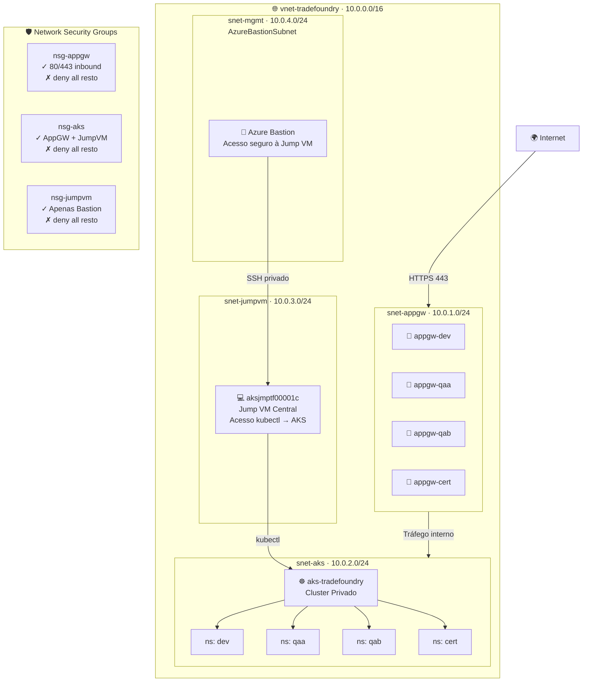

<div align="center">

# 🏗️ TradeFoundry

### Azure Cloud Infrastructure — Ambiente CERT

**Provisionamento completo de infraestrutura Azure para uma fintech de mercado de capitais,
espelhando a arquitetura real de ambientes de Pré-Produção com AKS privado, Jump VM centralizada e Application Gateways dedicados por ambiente.**

[](https://terraform.io)
[](https://azure.microsoft.com)
[](https://learn.microsoft.com/certifications/azure-administrator/)
[](https://kubernetes.io)
[](https://github.com/iamtexwiller/TradeFoundry/actions)
[](LICENSE)

[🏗️ Arquitetura](#️-arquitetura) · [📁 Estrutura](#-estrutura) · [🚀 Deploy](#-deploy) · [📋 Recursos](#-recursos)

</div>

---

## 💡 Contexto

**TradeFoundry** é uma fintech fictícia de mercado de capitais que precisa de uma infraestrutura Azure completa, segura e escalável — modelada a partir de arquiteturas reais de ambientes de Pré-Produção financeiros.

O projeto provisiona um **único ambiente CERT** contendo quatro sub-ambientes separados por namespace no mesmo cluster AKS privado — exatamente como grandes instituições financeiras operam:

| Sub-ambiente | Namespace | Propósito |
|---|---|---|
| **DEV** | `dev` | Desenvolvimento e integração contínua |
| **QAA** | `qaa` | Quality Assurance — testes funcionais |
| **QAB** | `qab` | Quality Assurance — testes de regressão |
| **CERT** | `cert` | Certificação — homologação final com negócio e parceiros |

---

## 🏗️ Arquitetura



---

## 📋 Recursos provisionados

### 🔐 Governança
| Recurso | Nome | Descrição |
|---|---|---|
| Resource Group | `RG-TRADEFOUNDRY-CERT` | Container de todos os recursos |
| Azure Policy | `tradefoundry-require-tags` | Exige tags obrigatórias em todos os recursos |
| Tags obrigatórias | `environment · project · owner` | Rastreabilidade e governança |

### 🌐 Networking
| Recurso | Nome | CIDR |
|---|---|---|
| Virtual Network | `vnet-tradefoundry` | `10.0.0.0/16` |
| Subnet AppGW | `snet-appgw` | `10.0.1.0/24` |
| Subnet AKS | `snet-aks` | `10.0.2.0/24` |
| Subnet Jump VM | `snet-jumpvm` | `10.0.3.0/24` |
| Subnet Bastion | `AzureBastionSubnet` | `10.0.4.0/24` |
| NSG AppGW | `nsg-appgw` | Permite 80/443 inbound |
| NSG AKS | `nsg-aks` | Permite apenas AppGW e Jump VM |
| NSG Jump VM | `nsg-jumpvm` | Permite apenas via Bastion |

### 🔀 Application Gateways
| Recurso | Nome | Namespace alvo |
|---|---|---|
| AppGW DEV | `appgw-dev` | `dev` |
| AppGW QAA | `appgw-qaa` | `qaa` |
| AppGW QAB | `appgw-qab` | `qab` |
| AppGW CERT | `appgw-cert` | `cert` |

### ☸️ AKS — Cluster Privado
| Configuração | Valor |
|---|---|
| Nome | `aks-tradefoundry` |
| Tipo | **Privado** — sem endpoint público |
| Subnet | `snet-aks` |
| Namespaces | `dev · qaa · qab · cert` |
| Acesso | Exclusivamente via Jump VM `aksjmptf00001c` |

### 💻 Jump VM — Centralizada
| Configuração | Valor |
|---|---|
| Nome | `aksjmptf00001c` |
| Função | Acesso centralizado a todos os clusters do ambiente |
| Subnet | `snet-jumpvm` |
| Acesso | Exclusivamente via Azure Bastion |
| Ferramentas | `kubectl · azure-cli · helm` |

### 🔐 Azure Bastion
| Configuração | Valor |
|---|---|
| Nome | `bastion-tradefoundry` |
| Função | Acesso seguro à Jump VM sem expor RDP/SSH |
| Subnet | `AzureBastionSubnet` |

---

## 🔄 Fluxo de acesso ao cluster

```
Operador
    │
    │  Acessa via browser
    ▼
Azure Bastion (HTTPS)
    │
    │  SSH privado
    ▼
Jump VM: aksjmptf00001c
    │
    │  kubectl
    ▼
AKS Privado: aks-tradefoundry
    │
    ├── namespace: dev
    ├── namespace: qaa
    ├── namespace: qab
    └── namespace: cert
```

---

## 🔄 Fluxo de tráfego das aplicações

```
Internet / Parceiros externos
    │
    │  HTTPS 443
    ▼
Application Gateway (por ambiente)
    │
    │  Roteamento interno
    ▼
AKS — Ingress Controller
    │
    ├── /app-banking  → Pod no namespace correto
    ├── /app-uif      → Pod no namespace correto
    └── /app-corp     → Pod no namespace correto
```

---

## 📁 Estrutura do projeto

```
TradeFoundry/
│
├── modules/                       → Módulos reutilizáveis
│   ├── 01-governance/             → Resource Group, Tags, Policy
│   │   ├── main.tf
│   │   ├── variables.tf
│   │   └── outputs.tf
│   ├── 02-networking/             → VNet, Subnets, NSGs, Bastion
│   │   ├── main.tf
│   │   ├── variables.tf
│   │   └── outputs.tf
│   ├── 03-jumpvm/                 → Jump VM centralizada
│   │   ├── main.tf
│   │   ├── variables.tf
│   │   └── outputs.tf
│   ├── 04-aks/                    → AKS privado + namespaces
│   │   ├── main.tf
│   │   ├── variables.tf
│   │   └── outputs.tf
│   ├── 05-appgateway/             → Application Gateways por ambiente
│   │   ├── main.tf
│   │   ├── variables.tf
│   │   └── outputs.tf
│   └── 06-monitoring/             → Application Insights, Alerts
│       ├── main.tf
│       ├── variables.tf
│       └── outputs.tf
│
├── environments/
│   └── cert/                      → Ambiente CERT (único)
│       ├── main.tf
│       ├── variables.tf
│       ├── outputs.tf
│       ├── providers.tf
│       └── terraform.tfvars
│
├── .github/
│   └── workflows/
│       ├── terraform-plan.yml     → PR: terraform plan
│       └── terraform-apply.yml    → Merge: terraform apply
│
├── docs/
│   └── architecture.md
│
├── scripts/
│   ├── init.sh
│   └── destroy.sh
│
├── backend.tf
├── providers.tf
└── README.md
```

---

## 🗺️ Roadmap

- [x] Definição da arquitetura
- [x] Documentação inicial
- [ ] **Módulo 01** — Governança & Tags
- [ ] **Módulo 02** — Networking (VNet, Subnets, NSGs, Bastion)
- [ ] **Módulo 03** — Jump VM centralizada (`aksjmptf00001c`)
- [ ] **Módulo 04** — AKS privado com namespaces (dev, qaa, qab, cert)
- [ ] **Módulo 05** — Application Gateways (um por ambiente)
- [ ] **Módulo 06** — Monitoramento (Application Insights, Alerts)
- [ ] **Pipeline CI/CD** — Terraform plan/apply automatizado
- [ ] **Ambiente CERT** — completo e funcional

---

## 🛠️ Stack tecnológico

<div align="center">


</div>

---

## 👤 Autor

**Tex Willer Gusman dos Santos**
Application Support Engineer L2 | Hybrid Cloud & On-Prem @ B3

[](https://www.linkedin.com/in/eutexwiller/)
[](https://www.texwiller.com.br)

---

<div align="center">

**TradeFoundry — Azure Cloud Infrastructure — Ambiente CERT**
Infraestrutura de mercado de capitais como código, espelhando arquiteturas reais de Pré-Produção.

</div>
